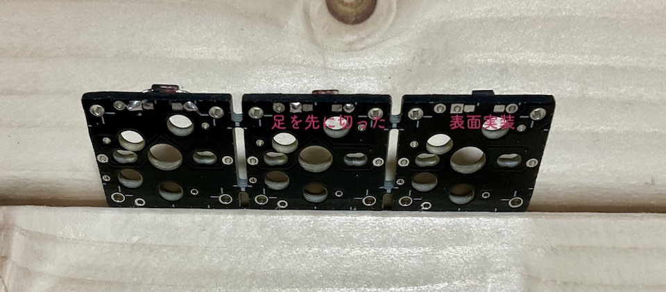
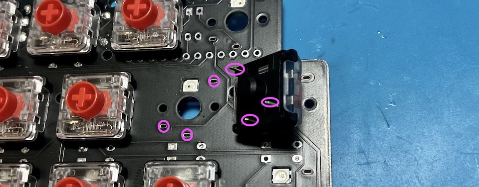
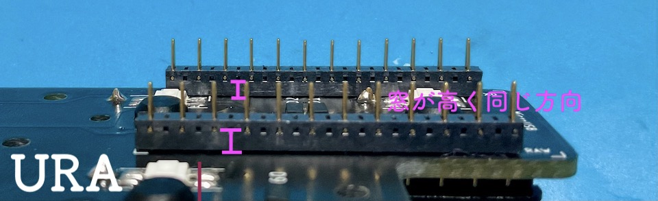
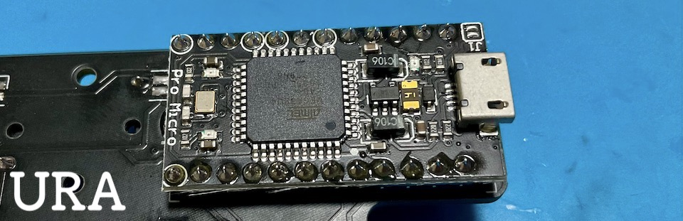
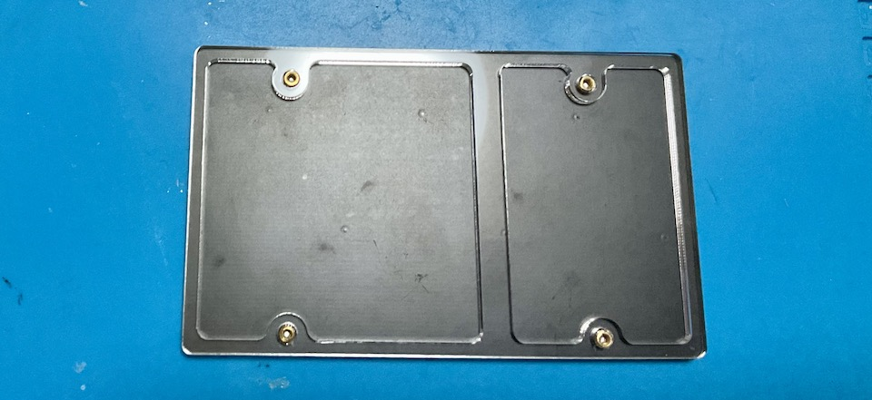
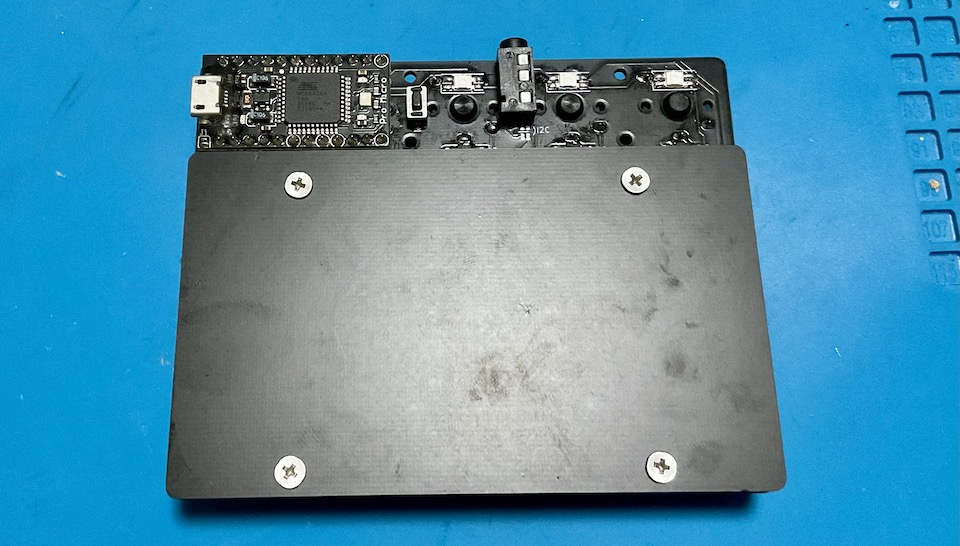
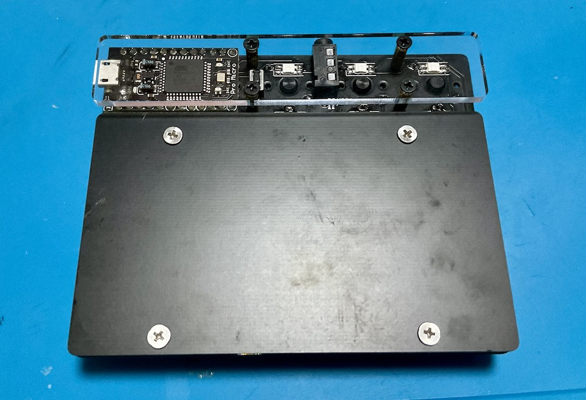
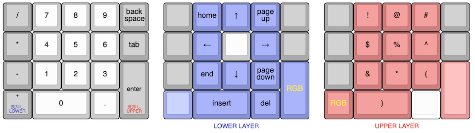

# Shotgun テンキーパッド ビルドガイド
- [キット内容](#キット内容)
- [組み立て方（はんだ付け）](#組み立て方はんだ付け)
- [動作テスト](#動作テスト)
- [組み立て方（後半）](#組み立て方後半)
- [カスタマイズ](#キーマップの確認変更方法)
- [おまけ](#おまけ)

## キット内容
  
||部品名|数| |
|-|-|-|-|
|1|メインボード（黒・大）|1||
|2|ミドルプレート（透明・中）|1||
|3|ボトムプレート（黒・中）|1||
|4|ボトムプレート（透明・小）|1||
|5|ネジ（短）|8|3mm|
|6|ネジ（長）|8|5mm|
|7|スペーサー（短）|4|3mm|
|8|スペーサー（長）|4|8mm|
|9|ダイオード|18||
|10|リセットスイッチ|1||
|11|ゴム足|4||

## キット以外に必要なもの
|部品名|数|||
|-|-|-|-|
|Pro Micro コンスルー付き|1||[遊舎工房様販売ページ](https://shop.yushakobo.jp/products/promicro-spring-pinheader)|
|キースイッチ|18|Kailh Choc V2|[遊舎工房様販売ページ](https://shop.yushakobo.jp/collections/all-switches/products/kailh-choc-v2)|
|キーキャップ|18|CherryMX互換|1Uが16個、2Uが2個です。|
|Micro USB ケーブル|1|データ通信対応でUSB2.0 Micro-Bのもの。|

※Kailh choc V1も使えますがキーキャップにご注意ください。  
  
## オプション
|部品名|数|||
|-|-|-|-|
|表面実装タイプのダイオード|17||[遊舎工房様販売ページ](https://shop.yushakobo.jp/products/a0800di-02-100)|
|SK6812MINI-E|17|[取り付け方](led.md)|[遊舎工房様販売ページ](https://shop.yushakobo.jp/products/sk6812mini-e-10)|
|WS2812B|3|無くてもバックライトだけ光ります。|[遊舎工房様販売ページ](https://shop.yushakobo.jp/products/a0800ws-01-10)|
|両面テープ||ねじの頭の0.5㎜より厚いものがおすすめです。||
 
## 必要な工具
|工具名| |
|-|-|
|はんだごて||
|はんだごて置き場||
|鉛入りはんだ||
|細いドライバー|+の1番ドライバー。|
|ニッパー等ダイオードの足を切れるもの|金属用でない場合刃こぼれします。|
|Microsoft Edge、もしくはGoogle Chrome||

## あると便利な工具
|工具名||
|-|-|
|耐熱シリコンマット||
|小皿||
|斜めに切ったタイプのこて先||
|温度調節可能なはんだごて|300度-350度前後|
|ピンセット|LEDには必須|
|フラックス|LEDには必須|
|テスター||
|フラックスリムーバー||
|マスキングテープ||
|はんだ吸い取り線||
|リードベンダー||
|ラジオペンチ||

## 組み立て方（はんだ付け）
はんだ付けのやり方は動画で見るとわかりやすいです。  
パーツは思ったより壊れないので落ち着いて作業すると失敗しにくいです。  
 - ホームセンターのDCMさんの解説動画(58秒～) https://www.youtube.com/watch?v=JFQg_ObITYE&t=58s
  
ダイオードをD1からD18まで取り付けます。  
足を曲げて裏から差し込みます。  
ダイオードには向きがあります。三角形の先の棒と黒線を合わせましょう。  
  

表で更に足を曲げて抜けないようにします。  
ダイオードと並行に曲げるとあとでキースイッチに干渉しにくいです。
  

はんだ付けをして足を切ります。  
マスキングテープでダイオードを固定して足を先に切ると綺麗に仕上がります。  
表面実装型を使うと表からは穴しか見えなくなります。  
  

リセットスイッチを裏から差し込み表ではんだ付けします。  
  

キースイッチを表から差し込み裏ではんだ付けします。  
  

メインボードの裏にコンスルーを挿します。  
コンスルーの窓が高くて両方とも同じ向きになるように設置します。  
挿すだけではんだ付けはしません。  
   
※画像は違うキットなので場所が違いますが基盤、パーツの裏表は同じです。  

コンスルーにPro Microを挿します。TX0, RAW, USBの位置をシルク印刷と合わせましょう。  
そして、Pro Micro側のコンスルーの足を半田付けします。  
   
※画像は違うキットなので場所が違いますが基盤、パーツの裏表は同じです。  

## 動作テスト
Pro Microに動作ソフト（ファームウェア）を書き込んで動作確認をしましょう。  
キットとPCをUSBケーブルでつないでください。   

ファームウェアをダウンロードしてPro Micro Web Updaterにアクセスしてください。
- テスト用ファームウェア [popntop_test.hex](https://github.com/Taro-Hayashi/Pop-n-Top/releases/download/untagged-6f31185aea07d10a6589/popntop_test.hex)
- Pro Micro Web Updater https://sekigon-gonnoc.github.io/promicro-web-updater/index.html

ファイルの選択ボタンを押してダウンロードしたファームウェアを指定したら、flashボタンを押しましょう。  
  

ブラウザのアドレスバーからメッセージが出てきたら、キットのリセットスイッチを押します。      
すると選択欄にArduino Microが出てきてクリックできるようになります。  
  

選択して接続を押すと書き込みが終わります。  
  
ファームウェアを更新する時もこの手順で行います。  

タイプすると1-17の数字が打てるはずです。  
反応しないキーが一箇所の場合スイッチ、同じ行で複数個の場合ダイオードのはんだが原因だと思います。   

お疲れ様でした。問題がなければはんだ付けは終了です。

## 組み立て方（後半）
USBケーブルを抜いてプレートを組付けます。  
アクリルからは保護フィルムを剥がしてください。割れやすいので気をつけましょう。  

ボトムプレート（黒・中）にスペーサー（短）をネジ（短）で取り付けます。  
スペーサーが隠れるようにミドルプレートを嵌めます。  
  

組み合わせたものをメインボードの裏からPro Microに重ならないようにネジ（短）で止めます。   
  
アクリルの左右が合っているとぴったり入ります。
間違ったまま押し込もうとすると故障の原因になるのでご注意下さい。

ボトムプレート（透明・小）にスペーサー（長）をネジ（長）で取り付けます。  
Pro Microを覆うようにネジ（長）で止めます。  
  

キーキャップを取り付けたら本番用のファームウェアに更新しましょう。
- [armors_via.hex](https://github.com/Taro-Hayashi/Pop-n-Top/releases/download/untagged-6f31185aea07d10a6589/popntop_via.hex)

ゴム足を貼ったら完成です。
  

## キーマップの確認、変更方法
このキットはレイヤー機能を使っています。

[Keyboard Layout Editor で見る](http://www.keyboard-layout-editor.com/##@_name=Layout%20-%20Armors%20KEYPAD;&@_x:0.5&a:7;&=F1&=F2&=F3&=F4&=F5&_x:1.5;&=F1&=F2&=F3&=F4&=F5&_x:1.5&c=#e0cb58&fa@:1;;&=前のパターン&_c=#cccccc;&=&=&_c=#e0cb58;&=次のパターン&_c=#decf7e;&=;&@_c=#cccccc&a:5&f:3;&=!%0A%0A%0A%0A%0A%0A1&_f:3;&=/@%0A%0A%0A%0A%0A%0A2&_f:3;&=#%0A%0A%0A%0A%0A%0A3&_f:3;&=$%0A%0A%0A%0A%0A%0A4&_f:3;&=%25%0A%0A%0A%0A%0A%0A5&_fa@:0&:1&:0&:0&:0&:0&:1;;&=~%0A長押しLOWER%0A%0A%0A%0A%0A%60&_x:0.5&c=#8792d6&a:7;&=F6&=F7&=F8&=F9&=F10&_c=#98a3d4;&=&_x:0.5&c=#cccccc;&=&_c=#e0cb58;&=色相+&=彩度+&=明度+&_fa@:1;;&=スピード+&_c=#cccccc;&=;&@_a:5&f:3;&=%5E%0A%0A%0A%0A%0A%0A6&_f:3;&=/&%0A%0A%0A%0A%0A%0A7&_f:3;&=*%0A%0A%0A%0A%0A%0A8&_f:3;&=(%0A%0A%0A%0A%0A%0A9&_f:3;&=)%0A%0A%0A%0A%0A%0A0&_c=#aaaaaa&a:7&f:3;&=shift&_x:0.5&c=#8792d6&f:3;&=F11&_f:3;&=F12&_c=#cccccc;&=&=&=&_c=#aaaaaa;&=&_x:0.5&c=#e0cb58&f:3;&=ON//OFF&_f:3;&=色相-&_f:3;&=彩度-&_f:3;&=明度-&_f:3;&=スピード-&_c=#aaaaaa;&=)  

使わないキーを削除したり使用頻度の高いキーを押しやすい位置に変更してみましょう。  
  
JSONファイルをダウンロードしたらChromeかEdgeでRemapにアクセスしてください。  
- [shotgun.json]()
- [Remap](https://remap-keys.app/)
  
  
左を選んで進んでいくとJSONファイルを求められるのでダウンロードしたものを指定します。  
   
  
変更が終わったら右上のflashボタンを押すと反映されます。  
  
  
上手くいかなくなったときはいったんリセットすると直ることがあります。  
  
  
## 液晶タブレットに乗せる場合
1番上の行を引っ掛ける事で液タブに乗せる事ができます。
　　
ゴム足を外して両面テープで固定すると安定します。  
跡が残るといけないので画面には保護フィルムを貼ってください。  

## おまけ
寸法です。ダンボールで作れるペーパークラフトもあります。
　　
　　
- [realsizeA4.pdf]()  
- ネットプリント番号  日まで　　

A4サイズです。定規があればプリントしなくても作れます。

ファームウェアのフォルダ  
https://github.com/Taro-Hayashi/qmk_firmware/tree/master/keyboards/shotgun
  
ミドル、ボトムプレートのデザインデータ  
[popntop_plates.zip]()  
発注先のルールに沿ってデータを修正してください。  

ご不明な点があればBOOTHのメッセージかtwitterのリプライでいつでも聞いてください。  
  
foostan様のフットプリントを流用、改変して使わせていただきました。  
https://github.com/foostan/kbd/  
https://github.com/foostan/kbd/blob/master/LICENSE  
