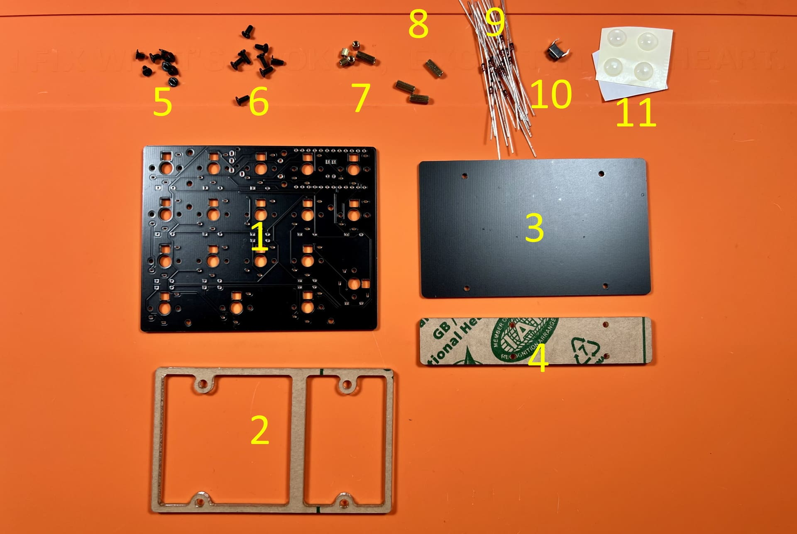
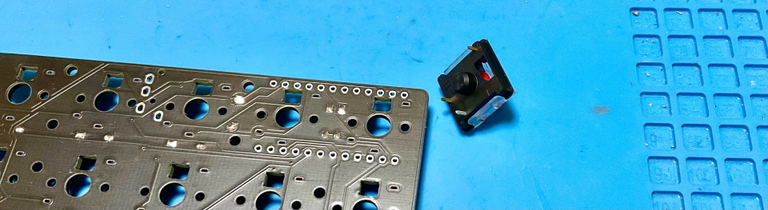
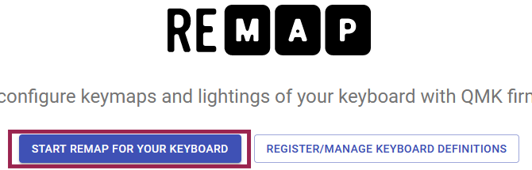

# Shotgun テンキーパッド ビルドガイド
- [キット内容](#キット内容)
- [組み立て方（はんだ付け）](#組み立て方はんだ付け)
- [動作テスト](#動作テスト)
- [組み立て方（後半）](#組み立て方後半)
- [カスタマイズ](#キーマップの確認変更方法)
- [おまけ](#おまけ)

## キット内容
  
||部品名|数| |
|-|-|-|-|
|1|メインボード|1||
|2|ミドルプレート|1||
|3|ボトムプレート|1||
|4|ボトムプレート|1||
|5|ネジ（短）|8|3mm|
|6|ネジ（長）|8|5mm|
|7|スペーサー（短）|4|3mm|
|8|スペーサー（長）|4|8mm|
|9|ダイオード|18||
|10|リセットスイッチ|1||
|11|ゴム足|4||

## キット以外に必要なもの
|部品名|数|||
|-|-|-|-|
|Pro Micro|1||[遊舎工房](https://shop.yushakobo.jp/products/pro-micro)、[コンスルー付き](https://shop.yushakobo.jp/products/promicro-spring-pinheader) / [TALPKEYBOARD](https://talpkeyboard.net/items/5b24504ba6e6ee7ec60063e3) / [Daily Craft Keyboard・コンスルー付き](https://shop.dailycraft.jp/products/promicro_with_conthrou)|
|コンスルー12ピン (高さ2mmか2.5mm)|2||[遊舎工房](https://shop.yushakobo.jp/products/31?_pos=1&_sid=ca92edae3&_ss=r&variant=37665714372769) / [TALPKEYBOARD](https://talpkeyboard.net/items/5e056626d790db16e2889233) / [Daily Craft Keyboard](https://shop.dailycraft.jp/products/conthrough)|
|キースイッチ|18|[Kailh choc V1](https://shop.yushakobo.jp/collections/all-switches/products/pg1350)、もしくは[Kailh Choc V2](https://shop.yushakobo.jp/collections/all-switches/products/kailh-choc-v2)|
|キーキャップ|18|V1は[専用キーキャップ](https://shop.yushakobo.jp/collections/keycaps/For-Choc-v1)、V2は[CherryMX互換](https://shop.yushakobo.jp/collections/keycaps/cherry-mx-%E4%BA%92%E6%8F%9B-%E3%82%AD%E3%83%BC%E3%82%AD%E3%83%A3%E3%83%83%E3%83%97)です。|
|Micro USB ケーブル|1||

## オプション
|部品名|数|||
|-|-|-|-|
|バックライトLED（SK6812MINI-E）|18|[取り付け方](led.md)|[遊舎工房](https://shop.yushakobo.jp/products/sk6812mini-e-10)、[秋月電子通商](https://akizukidenshi.com/catalog/g/gI-15478/)|
|アンダーグローLED（WS2812B）|5|無くてもバックライトだけ光ります。|[遊舎工房](https://shop.yushakobo.jp/products/a0800ws-01-10)、[秋月電子通商](https://akizukidenshi.com/catalog/g/gI-07915/)|

## 必要な工具
|工具名|
|-|
|はんだごて|
|こて先クリーナー（こて台）|
|鉛入りはんだ|
|精密ドライバー|
|ニッパー等ダイオードの足を切れるもの|
|Microsoft Edge、もしくはGoogle Chrome|

## あると便利な工具
|工具名||Amazon|
|-|-|-|
|耐熱シリコンマット|
|温度調節可能なはんだごて|
|斜めに切ったタイプのこて先|
|フラックス|
|フラックスリムーバー、IPA|
|ピンセット|
|マスキングテープ|
|テスター|
|はんだ吸い取り線|
|はんだ吸い取り器|

## 組み立て方（はんだ付け）

はんだ付けのやり方は動画で見るとわかりやすいです。  
パーツは思ったより壊れないので落ち着いて作業すると失敗しにくいです。  
 - ホームセンターのDCMさんの解説動画(58秒～) https://www.youtube.com/watch?v=JFQg_ObITYE&t=58s

それではダイオードをD1からD17まで取り付けます。  
足を曲げて裏から差し込みます。  
  
ダイオードには向きがあります。三角形の先の棒と黒線を合わせましょう。  

表で更に足を曲げて抜けないようにします。  
   
はんだ付けをして足を切ります。  
   

リセットスイッチを裏から差し込み表ではんだ付けします。  
  

キースイッチを表から差し込み裏ではんだ付けします。  
  

メインボードの裏にコンスルーを挿します。  
コンスルーの窓が高くて両方とも同じ向きになるように設置します。  
   
挿すだけではんだ付けはしません。  

コンスルーにPro Microを挿します。TX0, RAW, USBの位置をシルク印刷と合わせましょう。  
   
そして、Pro Micro側のコンスルーの足を半田付けします。  
    

## 動作テスト
Pro Microに動作ソフト（ファームウェア）を書き込んで動作確認をしましょう。  
キットとPCをUSBケーブルでつないでください。   

下のwebサイトにアクセスしてください。
- https://remap-keys.app/catalog/ZtSa0psj9iLGK8vNxolN/firmware

テストファームウェアを選んでFLASHします。
  
  

キットのリセットスイッチを押すとArduino Microが現れるので、クリックして接続します。
 

書き込みが完了したらウィンドウを閉じて大丈夫です。
 

アドレスバーやテキストエディタを使ってすべてのスイッチが反応することを確かめてください。  
お疲れ様でした。問題がなければはんだ付けは終了です。

## 組み立て方（後半）
USBケーブルを抜いてプレートを組付けます。  
アクリルからは保護フィルムを剥がしてください。割れやすいので気をつけましょう。  

メインボード裏面の赤丸の箇所にスペーサー（短）をネジ（短）で取り付けてミドルプレート（透明・中）を嵌めます。
  
ボトムプレート（黒・中）をネジ（短）で止めます。  

メインボードの残ったネジ穴にスペーサー（長）をネジ（長）で取り付け、ボトムプレート（透明・小）をネジ（長）で止めます。  
   

キーキャップを取り付けたら先ほどと同様の手順で本番用のファームウェアに更新しましょう。
- https://remap-keys.app/catalog/ZtSa0psj9iLGK8vNxolN/firmware
  

ゴム足を貼ったら完成です。
  

## キーマップの確認、変更方法
このキットはレイヤー機能を使っています。

[Keyboard Layout Editor で見る](http://www.keyboard-layout-editor.com/#/gists/2a190f28f4e33f743adb7195d6259d90)  

使わないキーを削除したり使用頻度の高いキーを押しやすい位置に変更してみましょう。  

ChromeかEdgeでRemapにアクセスしてください。  
- Remap https://remap-keys.app/

  
左を選んで進んでいくとアドレスバーからメッセージが出てキーボードを選択できます。  

変更が終わったら右上のflashボタンを押すと反映されます。  
  

## 液晶タブレットに乗せる場合
1番上の行を引っ掛ける事で液タブに乗せる事ができます。
　　
ゴム足を外して両面テープで固定すると安定します。  
跡が残るといけないので画面には保護フィルムを貼ってください。  

## おまけ
寸法です。ダンボールで作れるペーパークラフトもあります。
　　
　　
- [realsizeA4.pdf](https://github.com/Taro-Hayashi/Shotgun/releases/download/14.15/realsizeA4.pdf)  

A4サイズです。定規があればプリントしなくても作れます。

ファームウェアのフォルダ  
https://github.com/Taro-Hayashi/qmk_firmware/tree/master/keyboards/shotgun

VIA用JSONファイル [shotgun.json](https://github.com/Taro-Hayashi/Shotgun/releases/download/14.20/shotgun.json)  

ミドル、ボトムプレートのデザインデータ  
[shotgun_plates.zip](https://github.com/Taro-Hayashi/Shotgun/releases/download/14.31/shotgun_plates.zip)  
発注先のルールに沿ってデータを修正してください。  

ご不明な点があればBOOTHのメッセージかtwitterでいつでも聞いてください。  

foostan様のフットプリントを流用、改変して使わせていただきました。  
https://github.com/foostan/kbd/  
https://github.com/foostan/kbd/blob/master/LICENSE  
  
- BOOTH: https://tarohayashi.booth.pm/items/3154474
