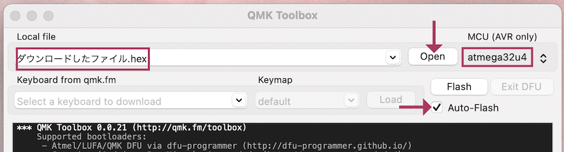
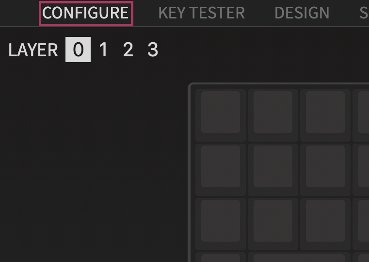

# Shotgun テンキーパッド ビルドガイド
- [キット内容](#キット内容)
- [組み立て方（はんだ付け）](#組み立て方はんだ付け)
- [動作テスト](#動作テスト)
- [組み立て方（後半）](#組み立て方後半)
- [カスタマイズ](#キーマップの確認変更方法)
- [おまけ](#おまけ)

## キット内容
  
||部品名|数| |
|-|-|-|-|
|1|メインボード（黒・大）|1||
|2|ミドルプレート（透明・中）|1||
|3|ボトムプレート（黒・中）|1||
|4|ボトムプレート（透明・小）|1||
|5|ネジ（短）|12|3mm|
|6|ネジ（長）|8|5mm|
|7|スペーサー（短）|6|3mm|
|8|スペーサー（長）|4|8mm|
|9|ダイオード|17||
|10|リセットスイッチ|1||
|12|ゴム足|4||

## キット以外に必要なもの
|部品名|数|||
|-|-|-|-|
|Pro Micro コンスルー付き|1||[遊舎工房様販売ページ](https://shop.yushakobo.jp/products/promicro-spring-pinheader)|
|キースイッチ|17|Kailh Choc V2(V1は未確認です)|[遊舎工房様販売ページ](https://shop.yushakobo.jp/collections/all-switches/products/kailh-choc-v2)|
|キーキャップ|17|CherryMX互換・1U||
|Micro USB ケーブル|1|データ通信対応でUSB2.0 Micro-Bのもの。|

## オプション
|部品名|数|||
|-|-|-|-|
|表面実装タイプのダイオード|17||[遊舎工房様販売ページ](https://shop.yushakobo.jp/products/a0800di-02-100)|
|SK6812MINI-E|17|[取り付け方](led.md)|[遊舎工房様販売ページ](https://shop.yushakobo.jp/products/sk6812mini-e-10)|
|WS2812B|3|無くてもバックライトだけ光ります。|[遊舎工房様販売ページ](https://shop.yushakobo.jp/products/a0800ws-01-10)|
|両面テープ||液タブに固定する場合。||
 
## 必要な工具
|工具名| |
|-|-|
|はんだごて||
|はんだごて置き場||
|鉛入りはんだ||
|細いドライバー|+の1番ドライバー。|
|ニッパー等ダイオードの足を切れるもの|金属用でない場合刃こぼれします。|

## あると便利な工具
|工具名||
|-|-|
|耐熱シリコンマット||
|小皿||
|斜めに切ったタイプのこて先||
|温度調節可能なはんだごて|300度-350度前後|
|ピンセット|LEDには必須|
|フラックス|LEDには必須|
|テスター||
|フラックスリムーバー||
|マスキングテープ||
|はんだ吸い取り線||
|リードベンダー||
|ラジオペンチ||

## 組み立て方（はんだ付け）
ダイオードはD1からD18まで取り付けます。  
足を曲げて裏から差し込みます。  
ダイオードには向きがあります。三角形の先の棒と黒線を合わせましょう。  
  

表で更に足を曲げて抜けないようにします。  
ダイオードと並行に曲げるとあとでキースイッチに干渉しにくいです。
  

はんだ付けをして足を切ります。  
マスキングテープでダイオードを固定して足を先に切ると綺麗に仕上がります。  
表面実装型を使うと表からは穴しか見えなくなります。  
  

リセットスイッチを裏から差し込み表ではんだ付けします。  
  

キースイッチを表から差し込み裏ではんだ付けします。  
  

メインボードの裏にコンスルーを挿します。  
コンスルーの窓が高くて両方とも同じ向きになるように設置します。  
挿すだけではんだ付けはしません。  
   
※画像は違うキットなので場所が違いますが基盤、パーツの裏表は同じです。  

コンスルーにPro Microを挿します。TX0, RAW, USBの位置をシルク印刷と合わせましょう。  
そして、Pro Micro側のコンスルーの足を半田付けします。  
   
※画像は違うキットなので場所が違いますが基盤、パーツの裏表は同じです。  
  
これでPro Microを抜き差しできるようになりました。  

## 動作テスト
Pro Microに動作ソフト（ファームウェア）を書き込んで動作確認をしましょう。  
キットとPCをUSBケーブルでつないでください。   

Chrome, Edgeを使っているならPro Micro Web Updaterだとブラウザだけでファームウェアを書き込めます。  
[Pro Micro Web Updaterを使う場合](promicrowebupdater.md)  

使わない場合、QMK Toolboxをインストールしてテスト用のファームウェアをダウンロードして下さい。  
- QMK Toolbox https://github.com/qmk/qmk_toolbox/releases

- テスト用ファームウェア [armors_test.hex](https://github.com/Taro-Hayashi/Pop-n-Top/releases/download/untagged-6f31185aea07d10a6589/popntop_test.hex)

Openを押してダウンロードしたファイルを指定してAuto-Flashにチェックを入れます。  
MCUがatmega32u4になっていることも確認します。  

　　
キットのリセットスイッチを押すとPro Microが赤く光り自動でファームウェアが書き込まれます。  
"Thank you"のメッセージが出たら書き込み完了です。
  
（エラーが出る場合Auto-Flashのチェックを外し、先にリセットスイッチを押してQMK ToolboxのFlashのボタンを押してみてください。）  

ファームウェアを更新する時もこの手順で行います。  

タイプすると1-17の数字が打てるはずです。  
反応しないキーが一箇所の場合スイッチ、同じ行で複数個の場合ダイオードのはんだが原因だと思います。   

お疲れ様でした。問題がなければはんだ付けは終了です。

## 組み立て方（後半）
USBケーブルを抜いてプレートを組付けます。  
プレートには向きがあります。アクリルからは保護フィルムを剥がしてください。割れやすいので気をつけましょう。  

ボトムプレート（黒・中）にスペーサー（短）をネジ（短）で取り付けます。  
スペーサーが隠れるようにミドルプレートを嵌めます。  
  

組み合わせたものをメインボードの裏からPro Microに重ならないようにネジ（短）で止めます。   
  

ボトムプレート（透明・小）にスペーサー（長）をネジ（長）で取り付けます。  
Pro Microを覆うようにネジ（長）で止めます。  
   

キーキャップを取り付けたら本番用のファームウェアに更新しましょう。
- [armors_via.hex](https://github.com/Taro-Hayashi/Pop-n-Top/releases/download/untagged-6f31185aea07d10a6589/popntop_via.hex)

ゴム足を貼ったら完成です。
  

## キーマップの確認、変更方法
このキットはレイヤー機能を使っています。

[Keyboard Layout Editor で見る](http://www.keyboard-layout-editor.com/##@_name=Layout%20-%20Armors%20KEYPAD;&@_x:0.5&a:7;&=F1&=F2&=F3&=F4&=F5&_x:1.5;&=F1&=F2&=F3&=F4&=F5&_x:1.5&c=#e0cb58&fa@:1;;&=前のパターン&_c=#cccccc;&=&=&_c=#e0cb58;&=次のパターン&_c=#decf7e;&=;&@_c=#cccccc&a:5&f:3;&=!%0A%0A%0A%0A%0A%0A1&_f:3;&=/@%0A%0A%0A%0A%0A%0A2&_f:3;&=#%0A%0A%0A%0A%0A%0A3&_f:3;&=$%0A%0A%0A%0A%0A%0A4&_f:3;&=%25%0A%0A%0A%0A%0A%0A5&_fa@:0&:1&:0&:0&:0&:0&:1;;&=~%0A長押しLOWER%0A%0A%0A%0A%0A%60&_x:0.5&c=#8792d6&a:7;&=F6&=F7&=F8&=F9&=F10&_c=#98a3d4;&=&_x:0.5&c=#cccccc;&=&_c=#e0cb58;&=色相+&=彩度+&=明度+&_fa@:1;;&=スピード+&_c=#cccccc;&=;&@_a:5&f:3;&=%5E%0A%0A%0A%0A%0A%0A6&_f:3;&=/&%0A%0A%0A%0A%0A%0A7&_f:3;&=*%0A%0A%0A%0A%0A%0A8&_f:3;&=(%0A%0A%0A%0A%0A%0A9&_f:3;&=)%0A%0A%0A%0A%0A%0A0&_c=#aaaaaa&a:7&f:3;&=shift&_x:0.5&c=#8792d6&f:3;&=F11&_f:3;&=F12&_c=#cccccc;&=&=&=&_c=#aaaaaa;&=&_x:0.5&c=#e0cb58&f:3;&=ON//OFF&_f:3;&=色相-&_f:3;&=彩度-&_f:3;&=明度-&_f:3;&=スピード-&_c=#aaaaaa;&=)  

使わないキーを削除したり使用頻度の高いキーを押しやすい位置に変更してみましょう。

Chrome, EdgeがインストールされていればRemapを使うとブラウザだけでキーマップを変更できます。  
[Remapを使う場合](remap.md)  

そうでない場合はVIAをインストールして、下記JSONファイルをダウンロードしてください。
- VIA [https://github.com/the-via/releases/releases](https://github.com/the-via/releases/releases)
- [armors.json](https://github.com/Taro-Hayashi/Pop-n-Top/releases/download/untagged-6f31185aea07d10a6589/popntop.json)

起動したらSETTINGタブに移りShow Design tabをオンにします。  
  

DESIGNタブが出てくるのでクリックして、LOADボタンを押してダウンロードしたJSONファイルを指定しましょう。  
CONFIGUREタブに行くとキーマップを設定できるようになっています。  

  
キーボードのシルエットの変更したいキーをクリックしてから打ちたい文字をクリックするとキーマップがかわり、既にキーボードには反映されています。  

## 液晶タブレットに乗せる場合
1番上の行を引っ掛ける事で液タブに乗せる事ができます。
　　
ゴム足を外して両面テープで固定すると安定します。  
跡が残るといけないので画面には保護フィルムを貼ってください。  

## おまけ
寸法とダンボールで作れるペーパークラフトを用意したのでサイズ感の確認にご利用下さい。
定規があればプリントしなくても作れます。
　　
shotgun_p.pdf  
ネットプリント  
  
プレートのデザインデータ [kicadプロジェクトファイル]()  
発注先のルールに沿ってデータを修正してください。  
  
ご不明な点があればBOOTHのメッセージかtwitterのリプライでいつでも聞いてください。  
  
foostan様のフットプリントを流用、改変して使わせていただきました。  
https://github.com/foostan/kbd/  
https://github.com/foostan/kbd/blob/master/LICENSE  
