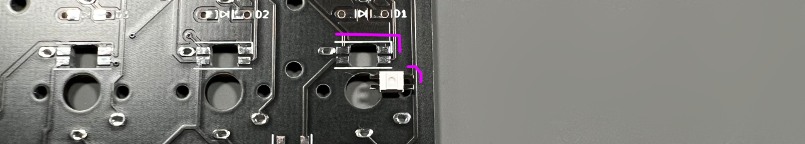
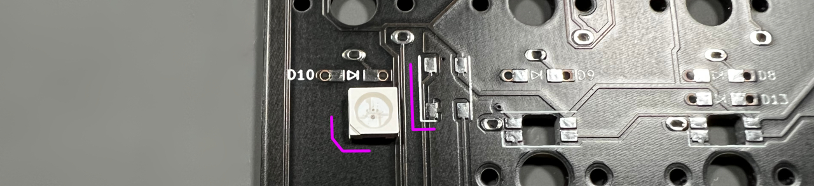
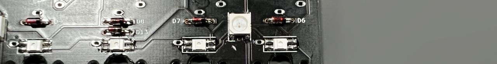

## LEDの取り付け方

LEDの切り欠きとシルク印刷のコーナーを合わせてはんだ付けしましょう。  
  
  
向きがバラバラなので毎回確認してください。  
  

左下と右下のキーを長押しでRGB操作用のレイヤーになります。  
  
[Keyboard Layout Editor で見る](http://www.keyboard-layout-editor.com/#/gists/2a190f28f4e33f743adb7195d6259d90)  

ブラウザの機能で戻ってください。
