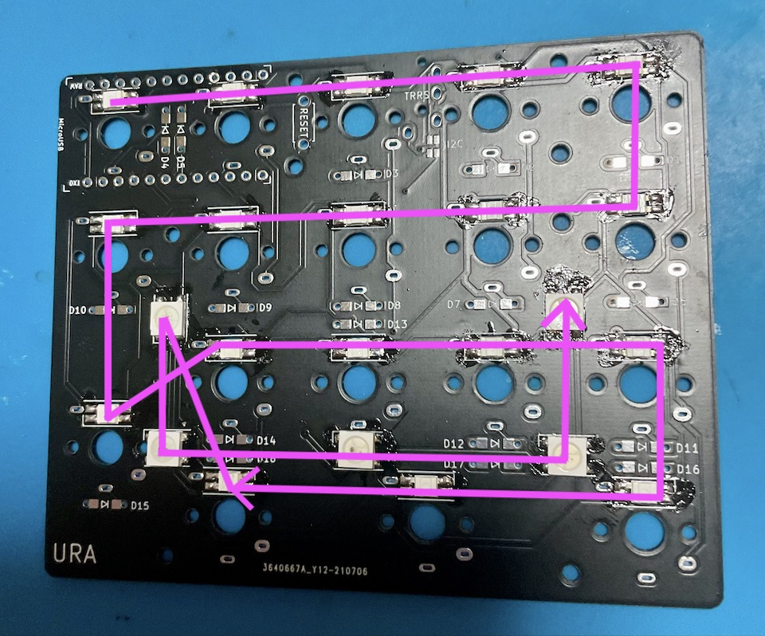
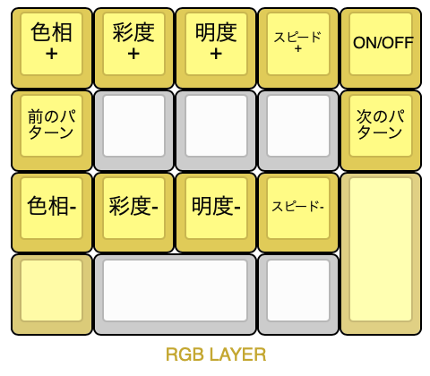

## LEDの取り付け方
LEDのはんだ付けはいつ行っても大丈夫です。  
一旦LEDなしで完成させてから後日やってもいいですし、ファームウェア書き込みの知識がある方は先にLEDだけ付けて発光のテストをすることもできます。  
失敗しても光らないだけなので気軽に挑戦してみてください。  

LEDの切り欠きとシルク印刷のコーナーを合わせてはんだ付けしましょう。  
  
向きがバラバラなので毎回確認してください。  
メインボードにフラックスを塗り、こて先にのせたはんだを流し込むようにするとスムーズに付けられます。  
青丸はキースイッチを安定させためだけの穴なので回路上どことも接続しておらずはんだが繋がってしまっても大丈夫ですが、穴が埋まってしまうとスイッチが入らなくなります。  
先にLEDを取り付ける予定の人ははんだ吸い取り線等を用意してください。

LEDテスト用のファームウェアです。  
[ledtest_default.tex](https://github.com/Taro-Hayashi/Pop-n-Top/releases/download/untagged-6f31185aea07d10a6589/ledtest_default.hex)
  
LEDは直列に配線されています。  
  
ひとつ発光しないLEDがある場合その先全てのLEDが光らなくなるので画像と見比べてどこが原因かを調べましょう。  

はんだ付けするだけでLEDが使えるようになります。  
ESC長押しでRGB操作用のレイヤーになります。  
  
[Keyboard Layout Editor で見る](http://www.keyboard-layout-editor.com/##@_backcolor=#ffffff&name=Layout%20-%20Shotgun%20NUMPAD;&@_c=#aaaaaa&a:7&fa@:4;;&=//&_c=#cccccc;&=7&=8&=9&_c=#aaaaaa;&=back%20space&_x:0.5;&=&_c=#8792d6;&=home&=↑&=page%20up&_c=#aaaaaa;&=&_x:0.5;&=&_c=#cf7e7e;&=!&=/@&=#&_c=#aaaaaa;&=&_x:0.5&c=#e0cb58;&=色相+&=彩度+&=明度+&_fa@:1;;&=スピード+&_fa@:2;;&=ON//OFF;&@_c=#aaaaaa&fa@:4;;&=*&_c=#cccccc;&=4&=5&=6&_c=#aaaaaa;&=tab&_x:0.5;&=&_c=#8792d6;&=←&_c=#cccccc;&=&_c=#8792d6;&=→&_c=#aaaaaa;&=&_x:0.5;&=&_c=#cf7e7e;&=$&=%25&=%5E&_c=#aaaaaa;&=&_x:0.5&c=#e0cb58&fa@:2;;&=前のパターン&_c=#cccccc;&=&=&=&_c=#e0cb58;&=次のパターン;&@_c=#aaaaaa&fa@:4;;&=-&_c=#cccccc;&=1&=2&=3&_c=#aaaaaa&t=#000000%0A#c91818&a:5&fa@:4&:1;&h:2;&=%0A長押しUPPER%0A%0A%0A%0A%0Aenter&_x:0.5&t=#000000&a:7;&=&_c=#8792d6;&=end&=↓&=page%20down&_t=#dbbc1f&h:2;&=RGB&_x:0.5&c=#aaaaaa&t=#000000;&=&_c=#cf7e7e;&=/&&=*&=(&_c=#e69a9a&h:2;&=&_x:0.5&c=#e0cb58;&=色相-&=彩度-&=明度-&_fa@:1;;&=スピード-&_c=#e0d084&h:2;&=;&@_c=#aaaaaa&t=#000000%0A#152bab&a:5&fa@:1&:1;;&=+%0A長押しLOWER&_c=#cccccc&t=#000000&a:7&fa@:4;&w:2;&=0&=.&_x:1.5&c=#a2abe8;&=&_c=#8792d6&w:2;&=insert&=del&_x:1.5&c=#cf7e7e&t=#dbbc1f;&=RGB&_t=#000000&w:2;&=)&_c=#ccccccc;&=&_x:1.5&c=#dbcb79;&=&_c=#cccccc&w:2;&=&=;&@_x:5.5&t=#152bab&f:3&w:5&h:0.5&d:true;&=LOWER%20LAYER&_x:0.5&t=#c91818&f:3&w:5&h:0.5&d:true;&=UPPER%20LAYER&_x:0.5&t=#a18806&f:3&w:5&h:0.5&d:true;&=RGB%20LAYER)  
  
  ブラウザの機能で戻ってください。
